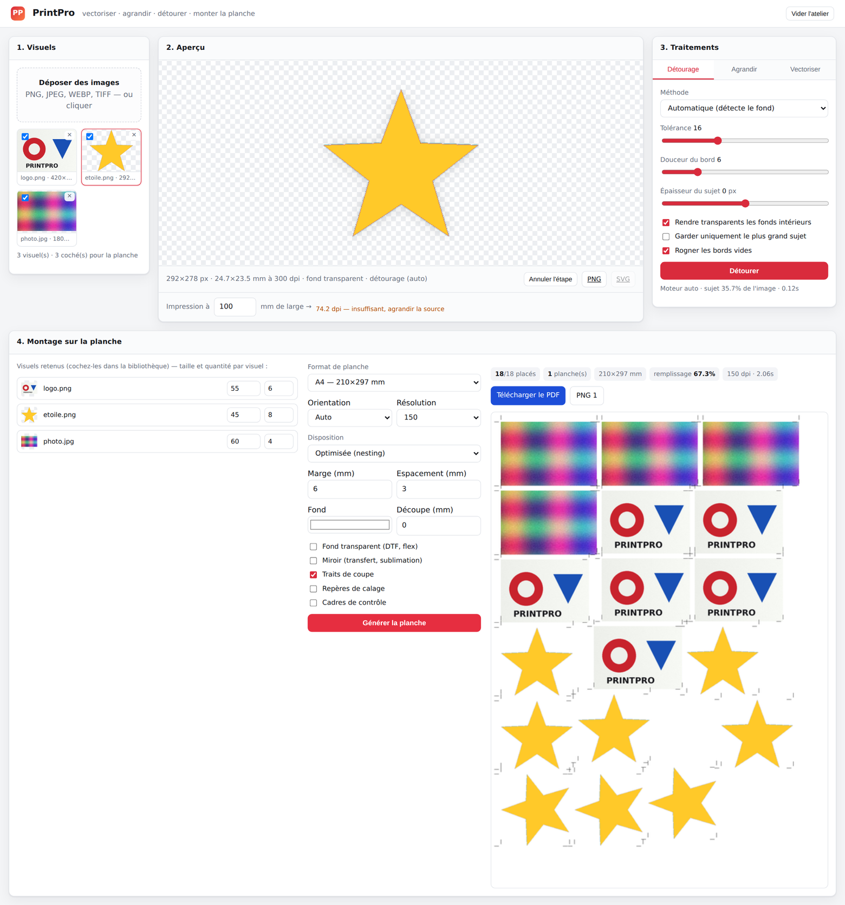

# PrintPro

**Atelier de préparation de fichiers pour l'impression.** Vectoriser, agrandir,
détourer et monter les visuels sur la planche — en ligne de commande ou depuis
une interface web locale.



Pensé pour les ateliers d'impression et le print à la demande : stickers, DTF,
flex/flocage, sublimation, affiches, étiquettes. Tout tourne **en local**,
aucune image n'est envoyée sur Internet, et **aucun binaire externe n'est
requis** (ni potrace, ni ImageMagick, ni Inkscape) : Pillow + NumPy + SciPy
suffisent.

---

## Ce que fait l'outil

| Fonction | Description |
|---|---|
| **Détourage** | Détecte la couleur de fond, l'efface, adoucit le bord, et **décontamine le liseré** (plus de halo blanc/vert autour du sujet). Moteur IA `rembg` utilisé automatiquement s'il est installé. |
| **Agrandissement** | Lanczos, renforcement de contours guidé par le gradient, ou **agrandissement vectoriel** (le visuel est tracé puis re-rendu : un logo reste net à ×20). Cible en facteur, en pixels ou **en millimètres à un dpi donné**. |
| **Vectorisation** | Quantification des couleurs, tracé exact des contours, courbes de Bézier, **sortie SVG** propre : fusion des couleurs proches, suppression des liserés d'anti-crénelage, nettoyage des points parasites. |
| **Montage sur planche** | Placement automatique (nesting MaxRects avec rotation), grille régulière ou remplissage total. Marges, espacement, **traits de coupe**, repères de calage, **contour de découpe** (kiss-cut), **miroir** pour le transfert, fond transparent. Export **PNG haute résolution + PDF multipage**. |
| **Contrôle qualité** | Indique le dpi réel obtenu pour une taille d'impression donnée et le facteur d'agrandissement nécessaire. |

---

## Installation

```bash
git clone <ce dépôt> && cd printpro
pip install -r requirements.txt        # Pillow, NumPy, SciPy, FastAPI, Uvicorn
```

ou en tant que paquet (fournit la commande `printpro`) :

```bash
pip install -e ".[web]"
```

Python 3.10 minimum.

**Modules optionnels** (détectés automatiquement, jamais obligatoires) :

```bash
pip install rembg          # détourage IA des sujets complexes (cheveux, fourrure)
# Real-ESRGAN : poser le binaire realesrgan-ncnn-vulkan dans le PATH
#               ou pointer la variable d'environnement PRINTPRO_ESRGAN
```

---

## Interface web

```bash
./run.sh                       # → http://127.0.0.1:8000
# ou
python -m printpro serve --port 8000
```

Déposez vos images, enchaînez les traitements (chaque étape est annulable),
cochez les visuels à imprimer, réglez la taille en millimètres et la quantité,
puis **Générer la planche** : la prévisualisation s'affiche et le PDF ainsi que
les PNG sont téléchargeables.

---

## Ligne de commande

```bash
python -m printpro --help      # ou simplement : printpro --help
```

### Détourer

```bash
printpro detourer photo.jpg -o sujet.png --tolerance 14 --rogner
printpro detourer logo.png  -o logo.png  --couleur "#ffffff" --contour -1
printpro detourer portrait.jpg -o portrait.png --methode ai     # si rembg installé
```

`--tolerance` : jusqu'où une couleur est considérée comme du fond (ΔE).
`--douceur` : largeur de la transition. `--contour` : ±px sur l'épaisseur du
sujet. `--defrange` : nettoyage du liseré de fond (1,5 px par défaut).

### Agrandir

```bash
printpro agrandir logo.png -o logo@300.png --mm 200 --dpi 300   # taille physique
printpro agrandir photo.jpg -o photo.png --facteur 4 --methode edge --debruiter 0.3
printpro agrandir icone.png -o icone.png --facteur 8 --methode vector
```

`--methode auto` choisit seul : **vector** pour les aplats et les logos,
**edge** pour les photographies.

### Vectoriser

```bash
printpro vectoriser logo.png -o logo.svg --couleurs 6 --detail 0.8
printpro vectoriser croquis.jpg -o trait.svg --mode bw --lissage 1.4
printpro vectoriser logo.png -o logo.svg --apercu controle.png   # PNG de contrôle
```

`--detail` = tolérance du tracé en pixels (plus bas = plus fidèle, plus de
nœuds). `--aire-min` ignore les détails minuscules, `--flou` lisse les scans
bruités.

### Monter la planche

```bash
# 12 stickers de 45 mm sur A4, traits de coupe et contour de découpe 2 mm
printpro montage sticker.png -o planches/ --largeur 45 --quantite 12 \
        --reperes --contour-decoupe 2 --trait-decoupe

# plusieurs visuels, tailles et quantités différentes, placement optimisé
printpro montage --item "logo.png:w=60:q=8" --item "etoile.png:w=35:q=20" \
        -o planches/ --page A3 --disposition pack --espacement 4

# film DTF 60 cm, fond transparent, en miroir pour le transfert
printpro montage visuel.png -o planches/ --page DTF-60 --largeur 120 \
        --quantite 30 --fond aucun --miroir

# format sur mesure (largeur x hauteur en mm)
printpro montage etiquette.png -o planches/ --page 320x450 --largeur 70 --quantite 24
```

Sortie : `planche-01.png`, `planche-02.png`, … et `planche.pdf`.

### Chaîner et contrôler

```bash
printpro preparer scan.jpg -o pret.png --detourer --mm 250 --dpi 300 --vectoriser
printpro controler visuel.png --mm 400 --dpi 300
printpro formats
```

---

## Depuis Python

```python
from printpro import (BgOptions, MontageItem, MontageOptions, UpscaleOptions,
                      VectorOptions, build_montage, export_pdf, load_rgba,
                      prepare, save_image)

image = load_rgba("logo.png")

# détourage + agrandissement à 200 mm de large à 300 dpi + SVG
result = prepare(
    image,
    remove_bg=True, bg_options=BgOptions(tolerance=14),
    upscale_options=UpscaleOptions(target_mm=(200, 150), target_dpi=300),
    vector_options=VectorOptions(colors=8),
    auto_trim=True,
)
save_image(result.image, "logo-print.png", dpi=300)
open("logo.svg", "w").write(result.svg)
print(result.report())

# planche A4 : 12 exemplaires de 45 mm, placement optimisé
montage = build_montage(
    [MontageItem(image=result.image, width_mm=45, quantity=12)],
    MontageOptions(page="A4", layout="pack", crop_marks=True, dpi=300),
)
export_pdf(montage, "planche.pdf")
print(montage.summary())
```

---

## API HTTP

Le serveur expose une API REST (documentation interactive sur `/api/docs`) :

| Méthode | Route | Rôle |
|---|---|---|
| `POST` | `/api/assets` | importer une ou plusieurs images |
| `GET` | `/api/assets` · `/api/assets/{id}/preview` | lister / prévisualiser |
| `POST` | `/api/assets/{id}/background` | détourer |
| `POST` | `/api/assets/{id}/upscale` | agrandir |
| `POST` | `/api/assets/{id}/vectorize` | vectoriser |
| `POST` | `/api/assets/{id}/undo` | annuler la dernière étape |
| `GET` | `/api/assets/{id}/svg` · `/download` · `/quality` | récupérer les résultats |
| `POST` | `/api/montage` | générer les planches (PNG + PDF) |

---

## Formats de planche fournis

A6 à A0, Letter, Legal, Tabloid, films **DTF 30 et 60 cm**, vinyle 50 cm, mug,
T-shirt A3 — plus n'importe quel format sur mesure (`--page 320x450`).
Résolutions courantes : 150 / 300 / 600 dpi.

---

## Comment ça marche

- **Détourage** — la bordure de l'image est échantillonnée puis regroupée par
  k-means dans l'espace CIE L\*a\*b\* ; une carte de distance colorimétrique
  donne le masque, seules les zones de fond *connectées au bord* sont effacées
  (l'intérieur d'un « O » reste au choix), le bord est adouci puis
  décontaminé : l'opacité des pixels de bord est recalculée à partir de la
  couleur locale du sujet, et la teinte du fond est retirée par démélange
  (`C = αF + (1−α)B` résolu en `F`).
- **Vectorisation** — quantification k-means en L\*a\*b\*, fusion des teintes
  indiscernables, vote majoritaire local puis dissolution des couleurs
  intermédiaires d'anti-crénelage, extraction exacte des contours en suivant
  les arêtes entre pixels, lissage Chaikin préservant les angles vifs,
  simplification Ramer–Douglas–Peucker, conversion en Béziers cubiques.
- **Agrandissement vectoriel** — le visuel est tracé puis rasterisé à la taille
  cible par un rasteriseur scanline anti-crénelé maison (règle even-odd,
  4 sous-lignes par pixel, mémoire en O(largeur)).
- **Montage** — nesting MaxRects « best short side fit » avec rotation à 90°,
  tout est calculé en millimètres, les pixels n'apparaissent qu'au rendu.
- **PDF** — écrit directement (images Flate ou JPEG, masque alpha `/SMask`,
  traits vectoriels pour les repères), sans dépendance PDF.

---

## Tests

```bash
pip install pytest httpx
pytest -q          # 81 tests : imagerie, détourage, tracé, montage, PDF, CLI, API
```

## Licence

MIT.
